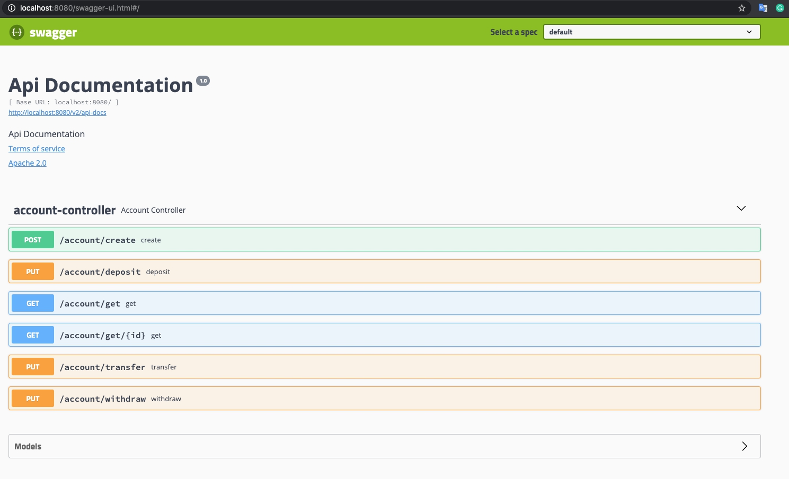
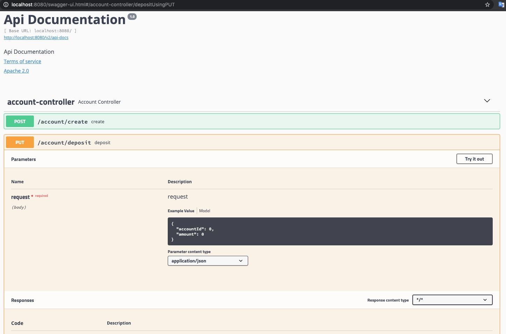

### Сервис по переводу денежных средств между счетами

Технологии: JDK 8, Spring (Boot, JPA/Hibernate и др.), H2, JUnit, Gradle, Git, Swagger

#### API 
(Документация доступна по следующей ссылке http://localhost:8080/swagger-ui.html#/)

*Допущения:* 
1. Все расчеты проводятся в "копейках" (тип long), чтобы избежать проблем с точностью расчета.
2. Предпологаю, что одни и теже данные обновляются редко, поэтому выбираю оптимистическую блокировку при работе с базой.


   
  
 

Собрать проект (gradle) ```./gradlew bootJar```

Запустить проект ```java -jar build/libs/accounting.jar```


